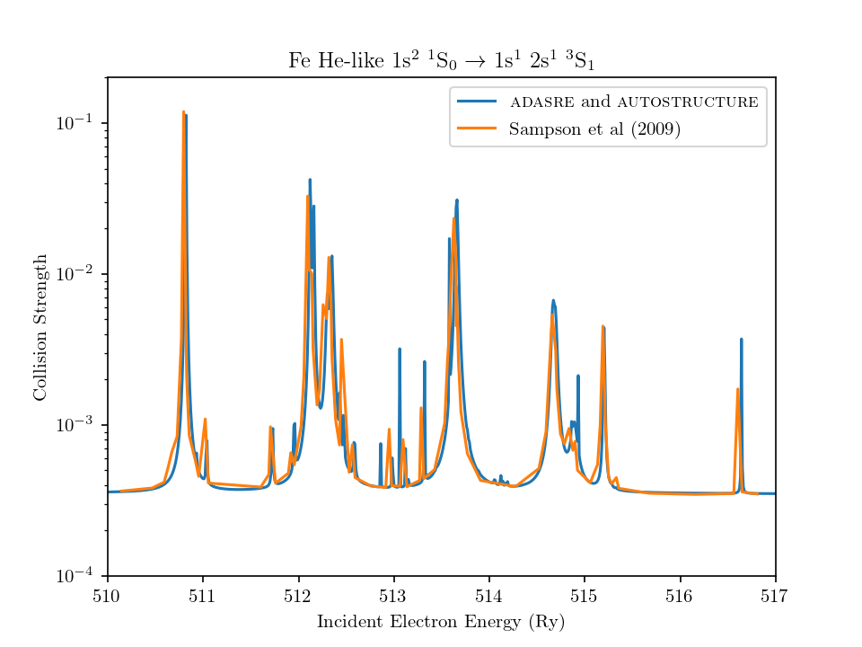

# adasre
Post processes the (un)formatted oic files of Nigel Badnell's `AUTOSTRUCTURE` [code](https://amdpp.phys.strath.ac.uk/autos/) to generate resonant-excitation data, that can be added to direct-excitation runs to produce an isolated resonant approximation for the total Maxwellian-Averaged collision strengths. A code such as [adf04Add](https://github.com/LeoMul/adf04Add), located at another of my respositories might be useful for this.

This code can process both `RUN='DR'` and `RUN='RE'` runs from the `AUTOSTRUCTURE` package. In either case, the radiative rates are ignored if they are present and the resonant-branching-ratios can include radiative damping. There is an option to calculate an approximation to DR - but right now there is no raditation between $nl$ blocks, so its usefulness is limited. Since the resonant excitation process mostly cares about Auger rates - this lack of radiation is unimportant. 

The code expects a file called `input` - containing a namelist `&adasre` with the number of bound states in the $N$ electron system `numtot`, the maxmimum level `nmax` for which $\Upsilon(T_e)$ values should consider, along with the corresponding output of the `LEVELS` files from the structure run. 

The main bottleneck is looping over a large amount of resonances. Unlike many atomic codes, this program is entirely dynamically allocated. The largest memory bottleneck is the lack of foreknowledge in the `AUTOSTRUCTURE` output for the number of Auger rates per block in the oic files. For this reason, three arrays are dynamically reallocated if they run over. The user can override the inital 'guess' at the dimension with the namelist vairable `initresdim`. A good choice of this variable can avoid reallocation completely, as well as the ~ 2.5 x memory overhead of doing so. Additionally, the layout of the oic files leads to a large number of cache misses. The loops in this code could probably be optimized better to account for this. 

Much like [adasdr](https://amdpp.phys.strath.ac.uk/autos/default/misc/), this code can take a mixture of formatted and unformatted input. The oic files should be symbolic linked to say o1,o2, o3u etc - with the suffix 'u' for unformatted files. 

Current todo's include, an mpi wrapper to process oic files in parallel, and potential reordering of array indices to help with cache misses. 

The code has been tested (in conjunction with autostructure) against work in the literature. The work of [Zhang & Sampson (1987)](https://adsabs.harvard.edu/full/1987ApJS...63..487Z) investigated He-like ions with resonant and distorted wave excitation. The collision strengths are later presented in [Sampson, Zhang & Fontes (2009)](https://www.sciencedirect.com/science/article/pii/S037015730900129X?ref=cra_js_challenge&fr=RR-1), which are compared with below. Aside from slight positional differences in the resonances, the heights and widths of the Lorentzians are in broad agreement giving confidence in the processor maintained in this repository.

